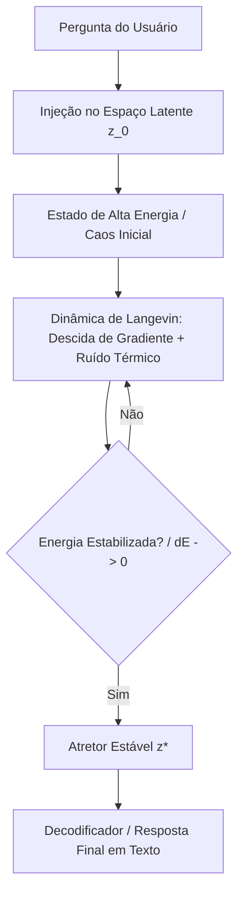

# Redes de Hopfield Modernas e Dinâmica de Atretores Caóticos

A biologia do cérebro nos mostra que a memória e o raciocínio não funcionam como linhas de código sequenciais, mas como **sistemas dinâmicos**. Quando somos confrontados com uma pergunta, o cérebro entra em um estado transiente caótico de alta energia que rapidamente decai e se estabiliza em um **atretor de memória** (um padrão estável de disparo neural que representa a compreensão ou a resposta).

Integrar **Redes de Hopfield Modernas** (MHNs - *Modern Hopfield Networks*) e **Modelos Baseados em Energia** (EBMs - *Energy-Based Models*) nos Transformers nos permite emular esse comportamento de forma rigorosa no espaço latente.

---

## O Cérebro como um Sistema Dinâmico de Energia

Podemos visualizar o espaço latente do modelo como um "vale de montanhas", onde cada atretor (vale) representa um conceito consolidado ou um fragmento de resposta. A pergunta da entrada projeta o estado inicial do modelo no topo de uma montanha (alta energia/caos). A dinâmica de reflexão faz com que o vetor latente "escorregue" pela encosta gravitacional da energia até estacionar no fundo de um vale (atretor estável).



---

## Formulação Matemática

### 1. Função de Energia de Hopfield Moderna
A Rede de Hopfield Moderna armazena uma matriz de padrões (memórias) $X = [x_1, x_2, \dots, x_N]^T \in \mathbb{R}^{N \times d}$. Para um estado de consulta intermediário $z \in \mathbb{R}^d$, a função de energia $E(z)$ é definida por:

$$E(z) = - \frac{1}{\beta} \log \left( \sum_{i=1}^N \exp(\beta x_i^T z) \right) + \frac{1}{2} \|z\|^2$$

Onde:
* $\beta$ é a constante inversa de temperatura ($1/\tau$).
* A função $\log\sum\exp$ (Log-Sum-Exp) atua como um agregador de similaridade de embeddings.
* O termo $\frac{1}{2} \|z\|^2$ é um regularizador quadrático que evita que o vetor divirja para o infinito.

### 2. A Regra de Atualização (Conexão com a Atenção)
A regra clássica de atualização para minimizar esta energia é baseada na derivada $\nabla E(z) = 0$, que colapsa para:
$$z^{new} = X^T \cdot \text{Softmax}(\beta X z)$$

Isso demonstra que **o mecanismo de atenção do Transformer é matematicamente equivalente ao passo de atualização de uma Rede de Hopfield Moderna**, onde as Chaves/Valores (*Keys/Values*) são as memórias armazenadas e a Consulta (*Query*) é o estado atual do pensamento.

---

## Injetando o Caos: Dinâmica de Langevin Estocástica

Se aplicarmos apenas a descida de gradiente padrão na função de energia, o modelo pode colapsar muito rapidamente no atretor mais próximo (que pode ser uma associação óbvia ou errada). Para replicar o "caos biológico", adicionamos **Ruído Térmico Estocástico** através da **Equação Diferencial Estocástica de Langevin**:

$$dz_t = -\nabla E(z_t) dt + \sqrt{2 T(t)} dW_t$$

Onde:
* $dW_t$ representa o movimento Browniano (ruído branco Gaussiano).
* $T(t)$ é a temperatura do sistema no instante $t$, que decai de forma análoga ao *Simulated Annealing* (recozimento simulado):
  $$T(t) = T_0 \cdot e^{-\alpha t}$$

Este ruído adiciona o componente caótico. Nas primeiras iterações do pensamento, a temperatura $T(t)$ alta agita o vetor $z_t$, permitindo-lhe saltar sobre barreiras de energia e explorar vales de atretores distantes. Conforme a temperatura esfria, o ruído cessa e o vetor converge suavemente para o atretor de menor energia global encontrado.

---

## Protótipo em PyTorch: Camada de Hopfield com Langevin

```python
import torch
import torch.nn as nn
import torch.nn.functional as F

class ModernHopfieldLangevinLayer(nn.Module):
    def __init__(self, d_model, num_memories, beta=8.0, steps=10, init_temp=0.5, cooling_rate=0.85):
        super().__init__()
        self.d_model = d_model
        self.beta = beta
        self.steps = steps
        self.init_temp = init_temp
        self.cooling_rate = cooling_rate
        
        # Matriz de Padrões / Memórias Armazenadas na Camada
        self.memories = nn.Parameter(torch.randn(num_memories, d_model) * (d_model ** -0.5))

    def energy_gradient(self, z):
        # z: (batch_size, seq_len, d_model)
        # 1. Calcula o Log-Sum-Exp escalado
        # logits: (batch_size, seq_len, num_memories)
        logits = torch.matmul(z, self.memories.T) * self.beta
        attn_weights = F.softmax(logits, dim=-1)
        
        # 2. Gradiente da função de energia com relação a z
        # dE/dz = z - X_T * Softmax(beta * X * z)
        retrieved = torch.matmul(attn_weights, self.memories)
        grad = z - retrieved
        return grad

    def forward(self, z_init):
        # z_init: (batch_size, seq_len, d_model)
        z = z_init.clone()
        temp = self.init_temp
        
        for step in range(self.steps):
            # 1. Calcular o gradiente de energia no estado atual
            grad = self.energy_gradient(z)
            
            # 2. Descida de Gradiente
            lr = 0.1 # Taxa de atualização do passo
            z = z - lr * grad
            
            # 3. Adicionar Ruído de Langevin se estiver em treinamento
            if self.training and temp > 0.001:
                # dW ~ N(0, I)
                noise = torch.randn_like(z)
                # Escalar o ruído de acordo com a temperatura
                noise_scale = torch.sqrt(torch.tensor(2.0 * temp * lr))
                z = z + noise_scale * noise
            
            # 4. Esfriamento da temperatura (Annealing)
            temp *= self.cooling_rate
            
        return z

# Exemplo de uso:
# hopfield_ebm = ModernHopfieldLangevinLayer(d_model=128, num_memories=1000, steps=12)
# input_states = torch.randn(4, 8, 128) # batch=4, seq_len=8, dim=128
# stabilized_attractors = hopfield_ebm(input_states)
```

---

> [!CAUTION]
> O maior risco desta abordagem é o surgimento de **atretores espúrios** (vales de energia indesejados criados por combinações lineares de memórias armazenadas). A regularização de $\beta$ (temperatura de atenção) e a escala de ruído de Langevin inicial devem ser finamente ajustadas para evitar que o modelo caia em estados de alucinação latente profunda.
