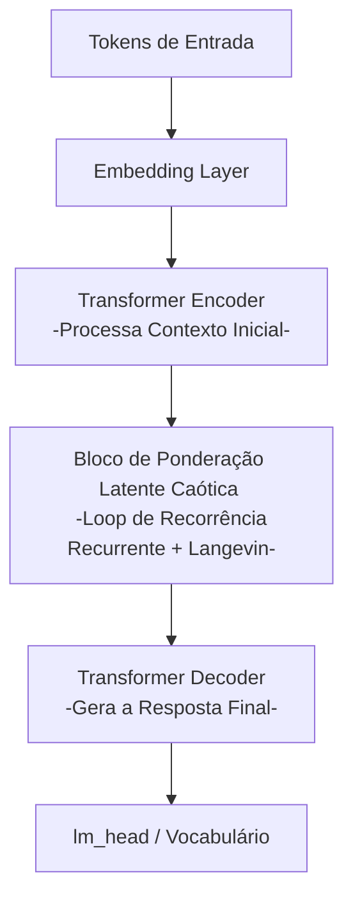

# Arquitetura Híbrida Proposta: Think-Vetor

A arquitetura **Think-Vetor** unifica os conceitos de **Cadeia de Pensamento Contínua (Continuous CoT)**, **Tempo de Computação Adaptativo (PonderNet)** e **Redes de Hopfield Modernas com Ruído de Langevin**. Esta combinação resulta em um modelo híbrido bio-inspirado capaz de alocar computação de forma flexível e explorar o espaço latente de forma não-linear (caótica) antes de colapsar na resposta final textual.

> [!NOTE]
> A implementação real e otimizada desta arquitetura em PyTorch pode ser encontrada nos arquivos de produção do repositório:
> * Modelo Base Think-Vetor: [src/model.py](file:///home/j/Área de trabalho/GitHub/crom-microllm-think-vetor/src/model.py)
> * Topologia Causal COCONUT: [src/coconut_model.py](file:///home/j/Área de trabalho/GitHub/crom-microllm-think-vetor/src/coconut_model.py)
> * Micro-LLM Lógica de Raciocínio: [src/logic_llm.py](file:///home/j/Área de trabalho/GitHub/crom-microllm-think-vetor/src/logic_llm.py)

---

## Estrutura da Arquitetura

O modelo é dividido em quatro estágios sequenciais:



### O Bloco de Ponderação Latente Caótica (C-PL)
Este bloco substitui as camadas intermediárias de um Transformer tradicional. O vetor latente gerado pelo encoder entra em um loop recorrente de $N$ iterações. 
1. **Passo Recorrente**: O vetor é processado pela mesma camada de atenção repetidamente.
2. **Camada de Langevin-Hopfield**: O vetor busca por atretores estáveis de memória abstrata armazenados nos pesos do modelo.
3. **Flutuação de Caos**: Adiciona-se um ruído Browniano que decai a cada passo (recozimento térmico).
4. **Halting Probability**: O classificador PonderNet decide, a cada passo, se a energia do sistema estabilizou, acumulando pesos de parada para mesclar as representações latentes.

---

## Implementação Completa do Protótipo em PyTorch

Abaixo está o código-fonte de um protótipo PyTorch completo para o modelo **Think-Vetor**:

```python
import torch
import torch.nn as nn
import torch.nn.functional as F

class LangevinHopfieldBlock(nn.Module):
    """
    Realiza a minimização de energia no espaço latente usando Dinâmica de Langevin.
    Mapeia a consulta intermediária em direção a atretores de memórias armazenadas.
    """
    def __init__(self, d_model, num_memories=512, beta=4.0):
        super().__init__()
        self.d_model = d_model
        self.beta = beta
        # Memórias armazenadas como parâmetros aprendíveis da rede
        self.memories = nn.Parameter(torch.randn(num_memories, d_model) * (d_model ** -0.5))

    def forward(self, z, temp=0.1, lr=0.1):
        # Gradiente da energia: dE/dz = z - X_T * Softmax(beta * X * z)
        logits = torch.matmul(z, self.memories.T) * self.beta
        attn_weights = F.softmax(logits, dim=-1)
        retrieved = torch.matmul(attn_weights, self.memories)
        grad = z - retrieved
        
        # Passo de descida de gradiente de energia
        z_next = z - lr * grad
        
        # Adição de ruído estocástico de Langevin (Simulated Annealing)
        if temp > 0:
            noise = torch.randn_like(z)
            noise_scale = torch.sqrt(torch.tensor(2.0 * temp * lr))
            z_next = z_next + noise_scale * noise
            
        return z_next

class ThinkVetorModel(nn.Module):
    def __init__(self, vocab_size=32000, d_model=256, nhead=8, num_layers=4, max_ponder_steps=6):
        super().__init__()
        self.d_model = d_model
        self.max_ponder_steps = max_ponder_steps
        
        # Embeddings de entrada e saída
        self.token_embeddings = nn.Embedding(vocab_size, d_model)
        
        # Encoder Inicial (Processamento rápido)
        encoder_layer = nn.TransformerEncoderLayer(d_model=d_model, nhead=nhead, batch_first=True)
        self.encoder = nn.TransformerEncoder(encoder_layer, num_layers=2)
        
        # Loop Recorrente
        self.recurrent_layer = nn.TransformerEncoderLayer(d_model=d_model, nhead=nhead, batch_first=True)
        self.step_embeddings = nn.Parameter(torch.randn(max_ponder_steps, d_model))
        
        # Bloco Baseado em Energia (Langevin-Hopfield)
        self.hopfield_ebm = LangevinHopfieldBlock(d_model=d_model, num_memories=1024)
        
        # Rede de parada do PonderNet
        self.halt_classifier = nn.Linear(d_model, 1)
        
        # Decoder Final (Geração de Texto)
        decoder_layer = nn.TransformerDecoderLayer(d_model=d_model, nhead=nhead, batch_first=True)
        self.decoder = nn.TransformerDecoder(decoder_layer, num_layers=2)
        
        self.lm_head = nn.Linear(d_model, vocab_size)

    def forward(self, input_ids, target_ids=None):
        # 1. Obter embeddings de entrada
        # input_embeddings: (batch_size, seq_len, d_model)
        x = self.token_embeddings(input_ids)
        
        # 2. Encoder inicial
        x_encoded = self.encoder(x)
        
        # 3. Bloco de Ponderação Latente Caótica (C-PL)
        batch_size, seq_len, d_model = x_encoded.shape
        accumulated_remainders = torch.ones(batch_size, seq_len, 1, device=x.device)
        pooled_latent_states = torch.zeros_like(x_encoded)
        
        current_state = x_encoded
        halting_probabilities = []
        
        # Temperatura inicial do caos
        init_temp = 0.5
        
        for k in range(self.max_ponder_steps):
            # Adiciona assinatura temporal do passo
            step_emb = self.step_embeddings[k].view(1, 1, d_model)
            state_temp = current_state + step_emb
            
            # Executa processamento de atenção recorrente
            next_state = self.recurrent_layer(state_temp)
            
            # Envia para o atretor de Hopfield com decaimento térmico de Langevin
            current_temp = init_temp * (0.6 ** k)
            next_state = self.hopfield_ebm(next_state, temp=current_temp, lr=0.1)
            
            # Classifica a probabilidade de parada
            halt_prob = torch.sigmoid(self.halt_classifier(next_state))
            
            # Tratamento estocástico de probabilidade acumulada (PonderNet)
            if k == self.max_ponder_steps - 1:
                step_halt_prob = accumulated_remainders
            else:
                step_halt_prob = halt_prob * accumulated_remainders
                accumulated_remainders = accumulated_remainders * (1.0 - halt_prob)
            
            # Contribuição ponderada
            pooled_latent_states = pooled_latent_states + step_halt_prob * next_state
            halting_probabilities.append(step_halt_prob)
            
            # Atualiza o estado
            current_state = next_state
            
        # 4. Decodificação Final
        # Para fins de simplificação autoregressiva durante o treinamento
        if target_ids is not None:
            tgt = self.token_embeddings(target_ids)
            # Decodifica usando o estado latente unificado (pooled_latent_states) como memória
            x_decoded = self.decoder(tgt, pooled_latent_states)
            logits = self.lm_head(x_decoded)
        else:
            # Inferência simples passo a passo (previsão do próximo token)
            # tgt é o último token predito
            tgt_last = self.token_embeddings(input_ids[:, -1:])
            x_decoded = self.decoder(tgt_last, pooled_latent_states)
            logits = self.lm_head(x_decoded[:, -1, :])
            
        return logits, halting_probabilities

# Exemplo de Inicialização do Modelo
# model = ThinkVetorModel(vocab_size=1000, d_model=64, nhead=2, max_ponder_steps=4)
# input_seq = torch.randint(0, 1000, (2, 8)) # Batch de 2, Sequência de 8 tokens
# target_seq = torch.randint(0, 1000, (2, 5)) # Alvo de 5 tokens (Teacher Forcing)
# logits, halt_probs = model(input_seq, target_seq)
# print("Logits shape:", logits.shape) # Deve ser (2, 5, 1000)
```

---

## Estratégias de Treinamento e Função de Perda Híbrida

Para treinar o modelo **Think-Vetor**, a função de perda total $\mathcal{L}_{total}$ deve equilibrar a precisão gramatical/textual e a eficiência de passos latentes. Ela é composta de três partes:

$$\mathcal{L}_{total} = \mathcal{L}_{CE} + \alpha \mathcal{L}_{ponder} + \beta \mathcal{L}_{entropy}$$

### 1. Perda de Geração de Texto ($\mathcal{L}_{CE}$)
Perda padrão de Entropia Cruzada (*Cross-Entropy*) aplicada na saída do decodificador (`lm_head`) em relação aos tokens de resposta gabaritados:
$$\mathcal{L}_{CE} = \text{CrossEntropy}(Logits, Target\_Tokens)$$

### 2. Perda de Parada Dinâmica ($\mathcal{L}_{ponder}$)
Com base no PonderNet, penalizamos a distribuição de passos de parada $p_k$ para se assemelhar a uma distribuição geométrica $\text{Geom}(p_p)$. Isso incentiva o modelo a usar poucos passos para perguntas fáceis e muitos passos apenas quando estritamente necessário.
$$\mathcal{L}_{ponder} = \text{KL-Divergência}\left(p \,\|\, \text{Geom}(p_p)\right)$$
Onde $p_p$ é o parâmetro geométrico alvo (ex: 0.3).

### 3. Regularização de Energia das Memórias ($\mathcal{L}_{entropy}$)
Para evitar que a Rede de Hopfield sofra de colapso de atratores (onde o modelo converge para a mesma resposta para qualquer pergunta), adicionamos uma perda de entropia na matriz de pesos de atenção do Hopfield, forçando a distribuição de ativações de memórias a explorar padrões diversos de ativação ao longo de um lote (*batch*).

---

> [!NOTE]
> Esta arquitetura oferece uma fusão perfeita de custo e desempenho. A etapa do loop de ponderação ocorre inteiramente nos tensores em GPU sem I/O de tokens, tornando o "pensamento" do modelo extremamente veloz em comparação a modelos tradicionais que utilizam tags de texto para raciocinar.
