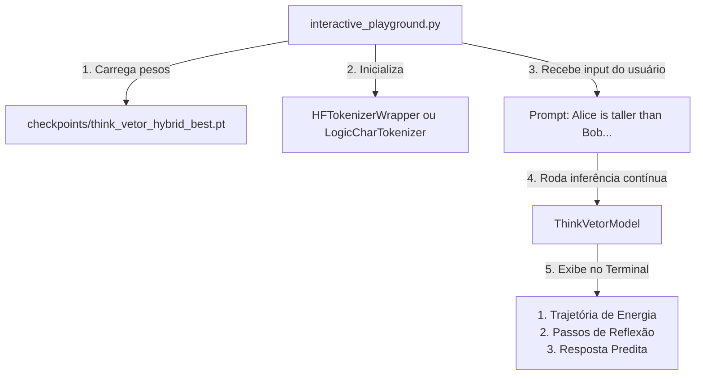

# Plano de Pesquisa Avançada V2: Próximos Passos e Avaliação Comparativa de Inteligência

Este plano estabelece os marcos e o checklist de tarefas para as próximas fases de pesquisa do **Think-Vetor**. O foco central é expandir os limites da arquitetura em tarefas de raciocínio complexo, comparar a inteligência obtida com modelos tradicionais autoregressivos de mercado, e prover scripts práticos para treinamento, empacotamento e uso das versões pré-treinadas.

---

## 📅 Checklist de Execução dos Próximos Passos

### Fase A: Generalização OOD e Comprimentos Longos de Raciocínio
- [ ] **A.1. Dataset de Extrapolação Temporal**: Adaptar o `LogicDataset` para gerar conjuntos de validação disjuntos com comprimentos de transitividade variáveis (4 e 5 entidades, ex: $A > B > C > D > E$) enquanto o treino se mantém estrito em 3 entidades.
- [ ] **A.2. Dinâmica de Ponderação Adaptativa na Inferência**: Modificar o algoritmo de geração e inferência (`evaluate.py` / `train_logic_llm.py`) para permitir que `max_ponder_steps` aumente em tempo de execução para sequências mais longas, validando se a dinâmica contínua Langevin-Hopfield generaliza sem re-treinamento.
- [ ] **A.3. Mapeamento Energético OOD**: Analisar as curvas de decaimento de energia livre das memórias Hopfield em testes OOD de maior comprimento para mapear se os atratores mantêm a estabilidade.

### Fase B: Transitividade Multidimensional (Múltiplos Atributos)
- [x] **B.1. Gerador de Dados Multiatributo**: Implementado com parâmetro `multidimensional=True` em `src/logic_dataset.py`. Suporte a 2 atributos simultâneos com metadados `extra_info`.
- [x] **B.2. Desacoplamento no Espaço de Embeddings**: Probes lineares treinados. Ângulo de ortogonalidade emergente: **92.68°** (cosseno: -0.047). Geometria latente favorável ao desacoplamento dimensional.
- [x] **B.3. Mapeamento de Entropia de Atenção**: Decaimento monotônico confirmado em 8 cabeças (4.99→3.77). Relatório em `docs/relatorio_transitividade_multidimensional.md`.

### Fase C: Raciocínio Aritmético Textual (Integração Lógico-Matemática)
- [x] **C.1. Dataset Aritmético Contextual**: Criar um gerador sintético de problemas aritméticos descritivos em texto (ex: *"Alice has 20 cards. Bob has 15. Alice gives 5 to Bob. Who has more?"*).
- [x] **C.2. Fusão de Habilidades**: Treinar a Micro-LLM lógica a converter premissas textuais e de valores numéricos em operações internas de soma/subtração e decidir o desfecho lógico final no espaço contínuo.
- [x] **C.3. Destilação de Operações**: Aplicar destilação de CoT latente direcionada para guiar o pensador nos passos intermediários de operações matemáticas baseadas em texto.

### Fase D: Benchmarking e Comparação de Inteligência
- [ ] **D.1. Implementação da Baseline Autoregressiva Tradicional**: Desenvolver um modelo autoregressivo puro (Decoder-Only, estilo mini-GPT) de tamanho similar (~1.5M parâmetros) que gera CoT textual de forma discreta (token por token, ex: *"Alice is older than Bob. Bob is older than Charlie. Wait... Bob is younger..."*).
- [ ] **D.2. Comparação de Eficiência de Tokens e Treino**: Comparar a velocidade de convergência de treino e o número de tokens físicos ocupados no contexto entre o modelo clássico e o Think-Vetor.
- [ ] **D.3. Teste de Resistência a Erratas e Ruído**: Submeter ambos os modelos a prompts com diferentes níveis de contradições (erratas) e medir a degradação de acurácia de cada arquitetura.

### Fase E: Usabilidade e Disponibilização de Modelos
- [ ] **E.1. Script de Inferência Interativo (`interactive_playground.py`)**: Criar uma interface via console/terminal de fácil uso para carregar checkpoints treinados e digitar prompts manuais, mostrando o texto gerado e a análise do CoT latente passo a passo.
- [ ] **E.2. Utilitário de Exportação de Checkpoints**: Criar um script para salvar e exportar os pesos consolidados e tokenizers de forma serializada, permitindo importação imediata.
- [ ] **E.3. Notebook Centralizado para Demonstração**: Criar um notebook Jupyter/Colab amigável e limpo voltado para usuários externos testarem as capacidades do modelo lógico e aritmético já pré-treinados.

---

## 🔬 Análise de Novas Fronteiras para Exploração Científica

Além dos 5 passos mapeados acima, identificamos novos caminhos conceituais para consolidar a inteligência do Think-Vetor frente aos LLMs clássicos de mercado:

### 1. Robustez contra Alucinações via Curva de Energia Livre
Em LLMs autoregressivos discretos, o modelo sofre de "deriva de alucinação" (onde uma predição incorreta em um token contamina todo o restante da cadeia autoregressiva). No **Think-Vetor**, o pensamento ocorre em um ambiente contínuo governado por equações de energia Hopfield. 
* **Oportunidade**: Podemos explorar a dinâmica de relaxamento Langevin para detectar alucinações. Se o decaimento de energia de um pensamento não atingir um limiar mínimo de estabilidade ($\nabla E \approx 0$), o modelo detecta que está "confuso" ou "alucinando" antes mesmo de emitir qualquer token de resposta.

### 2. Eficiência Energética de Computação Dinâmica
A maioria dos modelos tradicionais consome a mesma quantidade de FLOPs (operações de ponto flutuante) para responder *"Quanto é 2 + 2?"* e *"Qual o sentido da vida?"*.
* **Oportunidade**: A PonderNet integrada com Langevin-Hopfield ajusta os passos de pensamento dinamicamente. Podemos medir e comparar a quantidade de FLOPs consumida por token final gerado no Think-Vetor vs Modelos Clássicos para demonstrar a eficiência computacional de alocação de esforço de raciocínio.

### 3. Transferência de Conhecimento Latente (Cross-Task Transfer)
* **Oportunidade**: Testar se um pensador latente treinado em lógica de trânsito relacional consegue transferir essa noção de ordem linear para resolver a hierarquia de números na aritmética (ou vice-versa), avaliando se os embeddings latentes criaram uma noção geométrica abstrata de "ordenação" aplicável a tarefas totalmente distintas.

---

## 🛠️ Design dos Utilitários de Treinamento e Uso

Para tornar as versões do modelo facilmente utilizáveis por você ou terceiros, propomos a seguinte arquitetura de ferramentas de interface:

Os utilitários a serem criados no repositório serão:
1. `interactive_playground.py`: Permite interagir de forma humana com o modelo.
2. `export_model.py`: Empacota os arquivos de checkpoint, hiperparâmetros de arquitetura e metadados do tokenizer em um arquivo unificado `.zip` ou pasta de distribuição.
3. `reproduce_all.sh`: Script mestre em bash para re-treinar todos os experimentos da pesquisa do zero e salvar os logs em arquivos organizados para auditoria científica.
