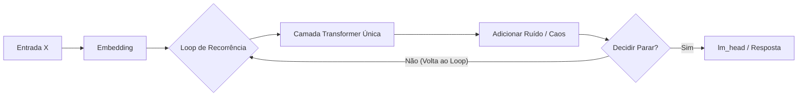

# Transformers Recorrentes e Dinâmica Caótica

Uma alternativa poderosa para o pensamento latente é o uso de **Transformers Recorrentes** (também conhecidos como *Universal Transformers*), onde a sequência de entrada não viaja apenas por camadas empilhadas linearmente, mas sim circula recursivamente pelas mesmas camadas por múltiplos ciclos de "reflexão" (*pondering steps*). 

Para tornar este loop bio-inspirado e eficiente, combinamos dois conceitos fundamentais:
1. **Tempo de Computação Adaptativo (ACT)** para determinar dinamicamente quando parar de pensar.
2. **Dinâmica Caótica Estocástica** que simula a flutuação e a incerteza do cérebro antes de tomar uma decisão.

---

## Universal Transformers e Recorrência Latente

Enquanto um Transformer padrão empilha $L$ camadas diferentes ($h^{l+1} = \text{Layer}_l(h^l)$), um **Universal Transformer** reaplica a mesma camada física $N$ vezes de forma recursiva:



A cada iteração $k$, adicionamos tanto a informação posicional clássica quanto o **embedding de passo de reflexão** $e_{step}(k)$ para que o modelo saiba em qual fase do pensamento ele está:
$$h^{(k+1)} = \text{TransformerLayer}\left(h^{(k)} + e_{step}(k)\right)$$

---

## O "Caos": Flutuações Estocásticas e Entropia de Atenção

Para imitar o comportamento dinâmico e caótico das redes neurais biológicas, introduzimos duas técnicas no loop:

### 1. Injeção de Ruído Latente (Perturbação Langevin)
Nos primeiros passos de reflexão, adicionamos um ruído estocástico gaussiano atenuado ao vetor latente. Isso empurra o modelo para fora de mínimos locais fáceis, encorajando-o a "explorar" caminhos alternativos de representação no espaço latente.
$$h^{(k+1)} = \text{TransformerLayer}\left(h^{(k)} + \eta_k\right)$$
Onde $\eta_k \sim \mathcal{N}(0, \sigma_k^2 I)$ e o desvio padrão decai geometricamente conforme os passos avançam (resfriamento de temperatura):
$$\sigma_k = \sigma_0 \cdot \gamma^k \quad (0 < \gamma < 1)$$

### 2. Atenção Caótica de Alta Entropia
A atenção do Transformer é calibrada por um parâmetro de temperatura $\tau$. A matriz de atenção $A$ é definida como:
$$A_{i,j} = \frac{\exp(q_i^T k_j / (\sqrt{d} \cdot \tau_k))}{\sum_m \exp(q_i^T k_m / (\sqrt{d} \cdot \tau_k))}$$

* **Fase Caótica Inicial (alta temperatura $\tau$):** A atenção é distribuída de forma quase uniforme (máxima entropia). O modelo correlaciona amplamente todas as informações sem foco definido.
* **Fase de Foco Final (baixa temperatura $\tau$):** A temperatura cai. A atenção colapsa em uma distribuição de baixa entropia, focando nos pontos chave do raciocínio estruturado.

---

## Tempo de Computação Adaptativo (ACT) e PonderNet

Em vez de executar sempre o mesmo número de ciclos de pensamento, o modelo deve alocar energia proporcional à dificuldade da pergunta. Usamos o mecanismo do **PonderNet**, que prevê a probabilidade de parada (*halting probability*) $p_k \in [0, 1]$ a cada passo $k$:

1. Em cada iteração $k$, uma pequena rede neural linear $f_{halt}(h^{(k)})$ calcula a probabilidade de parar naquele passo:
   $$\lambda_k = \text{Sigmoid}(W_{halt} \cdot h^{(k)})$$
2. A probabilidade acumulada de termos parado exatamente no passo $k$ é:
   $$p_k = \lambda_k \prod_{j=1}^{k-1} (1 - \lambda_j)$$
3. O loop encerra quando a probabilidade acumulada atinge um limiar próximo a 1, ou após um limite máximo de passos $N_{max}$.
4. A representação latente final $H_{final}$ enviada para o decodificador de texto é a média ponderada das representações de cada passo de reflexão:
   $$H_{final} = \sum_{k=1}^{N_{max}} p_k h^{(k)}$$

---

## Protótipo de Loop de Recorrência com PonderNet em PyTorch

```python
import torch
import torch.nn as nn
import torch.nn.functional as F

class RecurrentLatentPonderer(nn.Module):
    def __init__(self, d_model, nhead, max_steps=8, noise_scale=0.1):
        super().__init__()
        self.max_steps = max_steps
        self.noise_scale = noise_scale
        
        # Uma única camada de Transformer compartilhada para todas as iterações
        self.transformer_layer = nn.TransformerEncoderLayer(
            d_model=d_model, nhead=nhead, dim_feedforward=d_model*4, batch_first=True
        )
        
        # Vetores de embedding para cada passo de reflexão (ponder_step_embeddings)
        self.step_embeddings = nn.Parameter(torch.randn(max_steps, d_model))
        
        # Rede de decisão de parada (Halting Classifier)
        self.halt_layer = nn.Linear(d_model, 1)

    def forward(self, x):
        # x: (batch_size, seq_len, d_model)
        batch_size, seq_len, d_model = x.shape
        
        # Inicialização de variáveis do PonderNet
        halting_probabilities = []
        accumulated_remainders = torch.ones(batch_size, seq_len, 1, device=x.device)
        pooled_states = torch.zeros_like(x)
        
        current_state = x
        
        for k in range(self.max_steps):
            # 1. Adicionar o embedding de tempo do passo atual
            step_emb = self.step_embeddings[k].view(1, 1, d_model)
            state_with_time = current_state + step_emb
            
            # 2. Injetar ruído estocástico ("Caos") nas etapas iniciais (Annealing)
            if self.training and self.noise_scale > 0:
                current_noise_std = self.noise_scale * (0.5 ** k) # Decaimento geométrico
                noise = torch.randn_like(state_with_time) * current_noise_std
                state_with_time = state_with_time + noise
            
            # 3. Processar pela camada recorrente
            next_state = self.transformer_layer(state_with_time)
            
            # 4. Calcular probabilidade de parada
            # halt_logits: (batch_size, seq_len, 1)
            halt_prob = torch.sigmoid(self.halt_layer(next_state))
            
            # Ajuste de probabilidade baseado nas etapas anteriores
            if k == self.max_steps - 1:
                # No último passo, a probabilidade de parada deve ser o restante absoluto
                step_halt_prob = accumulated_remainders
            else:
                step_halt_prob = halt_prob * accumulated_remainders
                accumulated_remainders = accumulated_remainders * (1.0 - halt_prob)
            
            # Acumula o estado ponderado
            pooled_states = pooled_states + step_halt_prob * next_state
            halting_probabilities.append(step_halt_prob)
            
            # Atualiza o estado para o próximo loop
            current_state = next_state
            
        # pooled_states contém o vetor de pensamento consolidado
        return pooled_states, halting_probabilities

# Exemplo de Integração:
# ponderer = RecurrentLatentPonderer(d_model=256, nhead=4, max_steps=6)
# input_embeddings = torch.randn(2, 5, 256) # batch=2, seq=5, dim=256
# latent_thought, halts = ponderer(input_embeddings)
```

---

> [!IMPORTANT]
> A perda no PonderNet é otimizada adicionando uma penalidade de regularização geométrica ($\text{KL-Divergência}$) que força o modelo a parar de ponderar o mais rápido possível se não houver ganho de acurácia, evitando loops infinitos e desperdício computacional.
